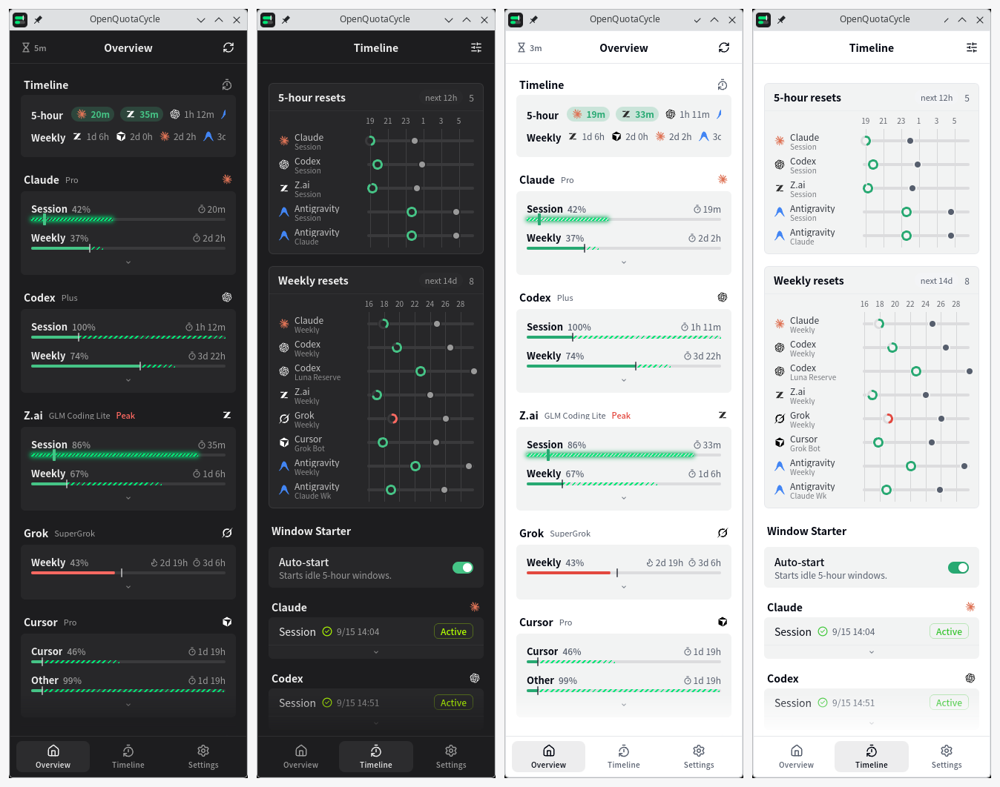

<p align="center">
  <picture>
    <source media="(prefers-color-scheme: dark)" srcset="docs/assets/logo-dark.svg">
    
  </picture>
</p>

# OpenQuotaCycle

A Linux desktop app for planning AI coding quotas around the 5-hour window.

<p align="center">
  <picture>
    <source media="(prefers-color-scheme: dark)" srcset="docs/assets/hero-dark.png">
    
  </picture>
</p>

Weekly limits are the budget. You cannot raise them from here, and using less is easy. Using *more* is not: the 5-hour window is a throttle. Start a long session against the weekly budget, and the session cap cuts the work short. For a 5-hour window, the only way to raise consumption per hour is to work across a reset and use two windows in one stretch. That only happens if the counter is already running.

OpenQuotaCycle keeps that environment ready. [Window Starter](docs/window-starter.md) starts idle 5-hour windows with a one-shot CLI request so you are not waiting for the first tick. Timeline shows when the next reset is. Overview hatches leftover that has pulled away from the pace tick — more you can still burn, and it melts at reset. In the last hour of a 5-hour window by default, leftover glows as melting so you can spend it across the reset.

The window lives in the tray. Close it to hide; click the icon or the global shortcut to bring it back.

## Download

[**Latest release**](https://github.com/oioi555/openquotacycle/releases/latest) — Linux `.deb` and `.AppImage`

**Arch Linux**

```bash
paru -S openquotacycle-bin
```

That package unpacks the GitHub Release `.deb`. From a checkout instead (`openquotacycle-git`):

```bash
cd aur
makepkg -si
```

## Features

- **Overview.** Session and weekly meters. The pace tick is linear expected usage *now*. The hatched slice is leftover that melts at reset if unused. In the last hour of a 5-hour window by default, leftover glows as melting. Fill past the tick means slow down.
- **Timeline.** Upcoming 5-hour and weekly resets on a shared axis. The Overview Timeline card leads with leftover that is melting at a 5-hour reset.
- **Window Starter.** On Timeline, optional. Starts idle 5-hour windows (Claude, Codex, Z.ai, Antigravity) so the wait is already cut. Pick the CLI harness on Customize.
- **Resident Linux window.** Tray icon, close-to-tray, global shortcut.
- **Plugins.** Each provider is a plugin. See the [Plugin API](docs/plugins/api.md).
- **[Local HTTP API](docs/local-http-api.md).** Read-only usage on `127.0.0.1:6736`.
- **[Proxy](docs/proxy.md).** SOCKS5 or HTTP for provider requests.

## Bundled providers

- [**Antigravity**](docs/providers/antigravity.md) — Session, Weekly, Claude, Claude Wk, optional local spend
- [**Claude**](docs/providers/claude.md) — session, weekly, extra usage, Fable
- [**Codex**](docs/providers/codex.md) — session, weekly, Luna Reserve, reviews, extra usage
- [**Copilot**](docs/providers/copilot.md) — credits, chat, completions
- [**Cursor**](docs/providers/cursor.md) — Total Usage, Cursor, Other, credits, requests, on-demand, Grok Bot
- [**Grok**](docs/providers/grok.md) — SuperGrok weekly, Extra Usage PAYG
- [**OpenCode Go**](docs/providers/opencode-go.md) — 5h, weekly, monthly, local spend, DeepSeek peak hours
- [**OpenRouter**](docs/providers/openrouter.md) — credits, key limit, period spend
- [**Z.ai**](docs/providers/zai.md) — session, weekly, tool calls, peak hours

## Development

UI is Svelte 5 (`src/svelte/`) on a shared core (`src/lib/`). Backend is Tauri 2 / Rust. IPC goes through `src/svelte/lib/backend.ts`.

```bash
bun tauri dev
```

`bun run dev` is Vite only — no Tauri IPC, settings store, or plugins.

```bash
bun install
bun run test --run
bun run typecheck
```

To keep the app running after the terminal detaches:

```bash
setsid bun tauri dev </dev/null >~/.cache/openquotacycle-dev.log 2>&1 &
```

## Credits

UX reference: [OpenQuota](https://github.com/deviffyy/OpenQuota). OpenUsage is Mac-only and was never run here.

Linux old-Tauri base: [Tuxmeter](https://github.com/debba/tuxmeter) by [Andrea Debernardi](https://github.com/debba).

Tuxmeter's Mac original: [OpenUsage](https://github.com/robinebers/openusage) by [Robin Ebers](https://github.com/robinebers).

## License

[MIT](LICENSE)

Copyright (c) 2026 oioi555, Andrea Debernardi, and Robin Ebers.

---

<details>
<summary><strong>Build from source</strong></summary>

### Prerequisites

- [Bun](https://bun.sh)
- [Rust](https://rustup.rs)
- Debian/Ubuntu: `libwebkit2gtk-4.1-dev` `libgtk-3-dev` `librsvg2-dev`
- Arch: `webkit2gtk-4.1` `gtk3`, plus the PKGBUILD `makedepends`

### Build

```bash
bun install
bun run bundle:plugins
bun tauri build
```

Output: `src-tauri/target/release/bundle/`.

The checkout recipe builds that same tree. `openquotacycle-bin` on the AUR downloads the GitHub Release `.deb`.

</details>
